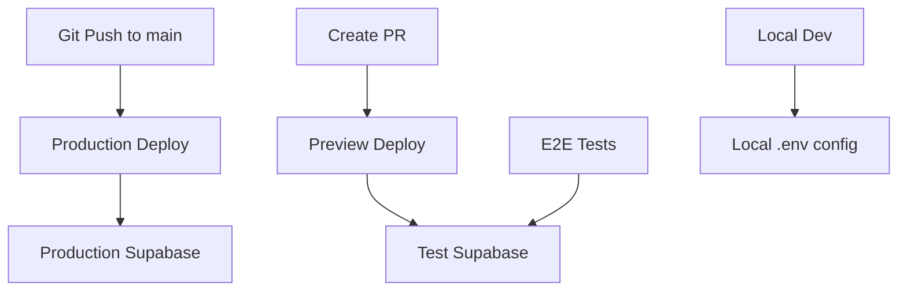

# Vercel Environment Setup Guide

## 🎯 Overview

This guide explains how to configure environment variables in Vercel to properly separate production and test environments for your Italian Flashcards application.

## 📊 Current Status

### ✅ **Completed**
- ✅ GitHub test database secrets added
- ✅ E2E workflow updated to use test credentials
- ✅ Test database created and configured

### 🔧 **Required: Vercel Environment Configuration**

## 🚀 Vercel Dashboard Setup

### Step 1: Access Vercel Environment Variables

1. **Go to Vercel Dashboard**
   - Visit: https://vercel.com/dashboard
   - Select your "italian-flashcards" project

2. **Navigate to Environment Variables**
   - Go to Settings tab
   - Click "Environment Variables" in the left sidebar

### Step 2: Configure Production Environment

Ensure these variables are set for **Production**:

| Variable Name | Value | Environment |
|---------------|-------|-------------|
| `VITE_SUPABASE_URL` | `https://gjftooyqkmijlvqbkwdr.supabase.co` | Production |
| `VITE_SUPABASE_ANON_KEY` | `[your-current-production-anon-key]` | Production |
| `NODE_ENV` | `production` | Production |

### Step 3: Configure Preview Environment

Add these variables for **Preview** (used for PR testing):

| Variable Name | Value | Environment |
|---------------|-------|-------------|
| `VITE_SUPABASE_URL` | `https://slhyzoupwluxgasvapoc.supabase.co` | Preview |
| `VITE_SUPABASE_ANON_KEY` | `<test_supabase_anon_key>` | Preview |
| `VITE_TEST_MODE` | `true` | Preview |
| `NODE_ENV` | `test` | Preview |

### Step 4: Configure Development Environment (Optional)

Add these for local development simulation:

| Variable Name | Value | Environment |
|---------------|-------|-------------|
| `VITE_SUPABASE_URL` | `https://slhyzoupwluxgasvapoc.supabase.co` | Development |
| `VITE_SUPABASE_ANON_KEY` | `<test_supabase_anon_key>` | Development |
| `VITE_TEST_MODE` | `true` | Development |
| `NODE_ENV` | `development` | Development |

## 📝 Detailed Instructions

### Adding Environment Variables in Vercel

1. **Click "Add Variable"**
2. **Enter Variable Details**:
   - **Name**: `VITE_SUPABASE_URL`
   - **Value**: `https://slhyzoupwluxgasvapoc.supabase.co`
   - **Environments**: Check ✅ Preview, ✅ Development

3. **Click "Save"**

4. **Repeat for each variable** listed in the tables above

### Environment Assignment Rules

| Environment | When Used | Purpose |
|-------------|-----------|---------|
| **Production** | `git push main` | Real users, production database |
| **Preview** | Pull requests | E2E testing, test database |
| **Development** | Manual deployments | Testing, test database |

## 🧪 Testing the Setup

### After Configuring Vercel

1. **Create a Test PR**:
   ```bash
   git checkout -b test-environment-setup
   git commit --allow-empty -m "test: verify test environment setup"
   git push origin test-environment-setup
   ```

2. **Create PR and Check**:
   - E2E tests should run against test database
   - Preview deployment should use test credentials
   - No interference with production data

3. **Verify Environment Variables**:
   - Check preview deployment logs
   - Confirm `VITE_TEST_MODE=true` in browser console
   - Verify connection to test Supabase project

### Verification Commands

Check preview deployment environment:
```javascript
// In browser console on preview deployment
console.log('Supabase URL:', import.meta.env.VITE_SUPABASE_URL);
console.log('Test Mode:', import.meta.env.VITE_TEST_MODE);
console.log('Node Env:', import.meta.env.NODE_ENV);
```

Expected output for **Preview**:
```
Supabase URL: https://slhyzoupwluxgasvapoc.supabase.co
Test Mode: true
Node Env: test
```

Expected output for **Production**:
```
Supabase URL: https://gjftooyqkmijlvqbkwdr.supabase.co
Test Mode: undefined
Node Env: production
```

## 🔄 Environment Flow

### Current Setup After Configuration



### Before vs After

| Scenario | Before (❌) | After (✅) |
|----------|-------------|-----------|
| **Production** | Production DB | Production DB |
| **PR Testing** | Production DB | Test DB |
| **E2E Tests** | Production DB | Test DB |
| **Local Dev** | Manual config | Test DB (optional) |

## 🛡️ Security Benefits

### Environment Isolation
- ✅ **Production data protected** from test interference
- ✅ **Clean test data** for predictable E2E tests
- ✅ **Separate credentials** for each environment
- ✅ **No test data pollution** in production

### Database Separation
- **Production**: Real user data, stable
- **Test**: Controlled data, can be reset
- **Independent**: Changes to one don't affect the other

## 🚨 Important Notes

### After Setup

1. **Redeploy may be required**: Vercel might need to redeploy to pick up new environment variables

2. **Test database schema**: Ensure test database has same schema as production:
   ```bash
   # Apply schema to test database (manual step)
   # Go to: https://app.supabase.com/project/slhyzoupwluxgasvapoc
   # Execute: contents of supabase/schema.sql
   ```

3. **Seed test data**:
   ```bash
   node scripts/seed-test-data.js
   ```

4. **Monitor usage**: Test database is on free tier - monitor usage

### Current Environment Status

| Environment | Database | Status |
|-------------|----------|--------|
| **Production** | gjftooyqkmijlvqbkwdr | ✅ Active |
| **Test** | slhyzoupwluxgasvapoc | ✅ Ready |

## 🔧 Troubleshooting

### If E2E Tests Still Use Production

1. **Check GitHub Secrets**: Verify `VITE_SUPABASE_URL_TEST` and `VITE_SUPABASE_ANON_KEY_TEST` exist
2. **Check Workflow**: Ensure E2E workflow uses `*_TEST` secrets
3. **Check Vercel**: Ensure Preview environment has test credentials

### If Preview Uses Production

1. **Check Vercel Environment Variables**
2. **Verify environment assignment** (Preview should use test credentials)
3. **Force redeploy** preview environment

### Verification Commands

```bash
# Check GitHub secrets
gh secret list

# Check repository
git log --oneline -5

# Test local environment
cp .env.test.local .env.local
npm run dev
```

## 📞 Support

- **Vercel Dashboard**: https://vercel.com/dashboard
- **Test Database**: https://app.supabase.com/project/slhyzoupwluxgasvapoc
- **Production Database**: https://app.supabase.com/project/gjftooyqkmijlvqbkwdr
- **Documentation**: `docs/TEST_DATABASE_SETUP.md`
