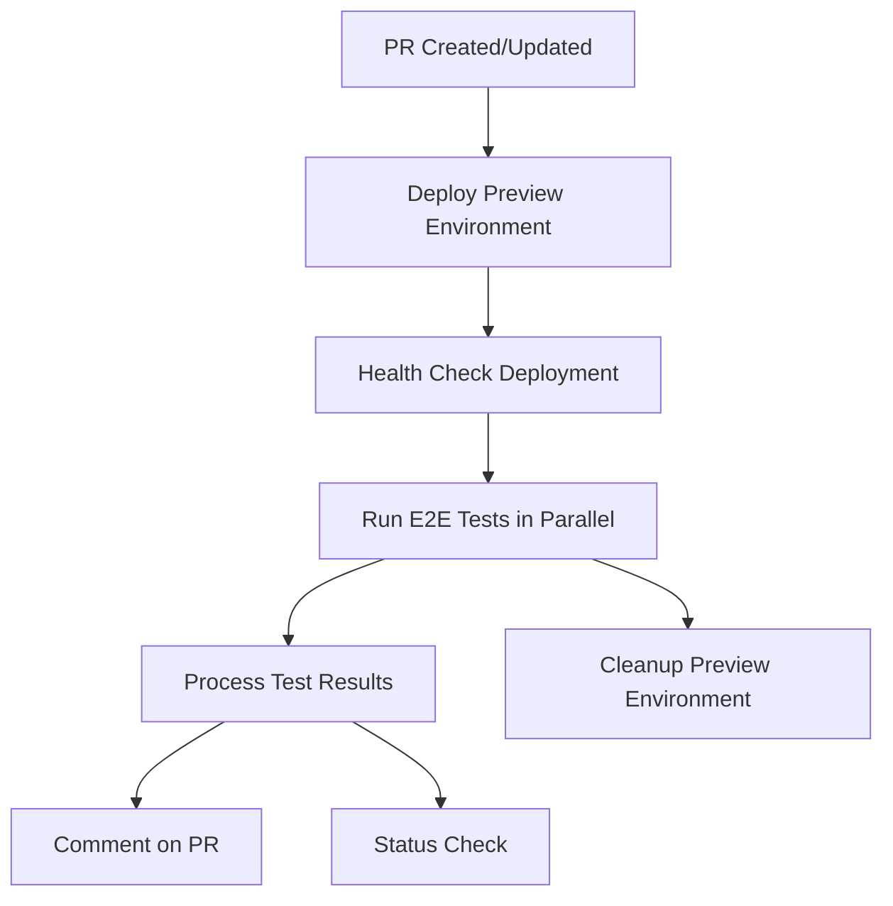

# E2E Testing Pipeline Documentation

## Overview

This project implements a comprehensive End-to-End (E2E) testing pipeline that automatically:

1. **Triggers on Pull Requests** - Runs when PRs are opened, updated, or reopened
2. **Deploys Preview Environment** - Creates a temporary Vercel preview deployment
3. **Runs E2E Tests** - Executes Playwright tests against the preview deployment
4. **Reports Results** - Comments on the PR with test results and preview links
5. **Cleans Up** - Removes the preview deployment after testing

## Architecture

### Workflow Structure



### Components

1. **GitHub Workflow** (`.github/workflows/pr-e2e-tests.yml`)
   - Orchestrates the entire pipeline
   - Manages concurrent execution
   - Handles cleanup and error scenarios

2. **Playwright Configuration** (`playwright.config.ts`)
   - Multi-browser testing (Chrome, Firefox, Safari)
   - Mobile viewport testing
   - Test reporting and artifacts

3. **E2E Tests** (`e2e/`)
   - Comprehensive application testing
   - User journey validation
   - UI interaction verification

4. **Vercel Configuration** (`vercel.json`)
   - Deployment settings
   - GitHub integration
   - Environment configuration

## Setup Instructions

### Prerequisites

1. **Vercel Account** - Set up a Vercel account and project
2. **GitHub Repository** - Connected to Vercel with appropriate permissions
3. **Node.js 18+** - For running tests and build processes

### Environment Variables

Add these secrets to your GitHub repository settings (`Settings > Secrets and variables > Actions`):

```bash
VERCEL_TOKEN=your_vercel_token_here
VERCEL_ORG_ID=your_org_id_here
VERCEL_PROJECT_ID=your_project_id_here
```

#### Getting the Values

1. **VERCEL_TOKEN**: Go to [Vercel Account Tokens](https://vercel.com/account/tokens) and create a new token

2. **VERCEL_ORG_ID** and **VERCEL_PROJECT_ID**: Run `vercel link` in your project directory to link it with Vercel. The IDs will be saved to `.vercel/project.json`

### Quick Setup

Run the setup script to validate your environment:

```bash
npm run setup:e2e
```

This will:
- Check if required tools are installed
- Validate configuration files
- Provide setup instructions
- Display required environment variables

## Usage

### Automatic Testing (Recommended)

Tests run automatically on every pull request. The workflow will:

1. Deploy your PR to a preview environment
2. Run E2E tests against the preview
3. Comment on the PR with results
4. Clean up the preview environment

### Manual Testing

#### Local Development

```bash
# Start development server
npm run dev

# Run E2E tests against local server
npm run test:e2e

# Run tests with interactive UI
npm run test:e2e:ui

# Run tests with browser visible (headed mode)
npm run test:e2e:headed
```

#### Against Preview Deployment

```bash
# Set the preview URL
export PLAYWRIGHT_TEST_BASE_URL=https://your-preview-url.vercel.app

# Run tests
npm run test:e2e
```

## Test Configuration

### Browser Matrix

Tests run against multiple browsers and viewports:

- **Desktop**: Chrome, Firefox, Safari
- **Mobile**: Chrome (Pixel 5), Safari (iPhone 12)

### Test Features

- **Parallel Execution** - Tests run concurrently for faster feedback
- **Retry Logic** - Failed tests retry automatically in CI
- **Rich Reporting** - HTML reports, screenshots, and videos
- **Artifact Collection** - Test results uploaded for debugging

### Test Structure

```typescript
// e2e/home.spec.ts
test.describe('Italian Flashcards App', () => {
  test('homepage displays mode selection', async ({ page }) => {
    // Test implementation
  });
});
```

## Workflow Details

### Jobs Breakdown

1. **deploy-preview**
   - Builds and deploys to Vercel
   - Performs health checks
   - Outputs deployment URL and ID

2. **e2e-tests**
   - Runs in parallel for each browser
   - Uses the preview deployment URL
   - Uploads test artifacts

3. **test-results**
   - Processes test outcomes
   - Comments on PR with results
   - Creates test summary

4. **cleanup**
   - Removes preview deployment
   - Runs regardless of test results

5. **status-check**
   - Final status for branch protection rules

### Concurrency Control

```yaml
concurrency:
  group: e2e-${{ github.event.pull_request.number }}
  cancel-in-progress: true
```

This ensures only one E2E workflow runs per PR, canceling previous runs when new commits are pushed.

## Branch Protection Rules

To require E2E tests to pass before merging:

1. Go to repository **Settings > Branches**
2. Add a branch protection rule for `main`
3. Enable "Require status checks to pass before merging"
4. Select "E2E Status Check" from the available status checks

## Troubleshooting

### Common Issues

1. **Tests failing locally but passing in CI**
   - Check if using correct base URL
   - Ensure dev server is running
   - Verify test timeouts

2. **Vercel deployment fails**
   - Check Vercel token permissions
   - Verify project is linked correctly
   - Check build configuration

3. **Tests timing out**
   - Increase timeouts in playwright.config.ts
   - Check application performance
   - Verify health check logic

### Debug Information

Test artifacts are automatically collected:
- Screenshots on failure
- Videos for failed tests
- HTML test reports
- JSON/XML test results

### Logs and Monitoring

- **GitHub Actions logs** - Detailed workflow execution
- **Vercel deployment logs** - Build and deployment issues
- **Playwright reports** - Test execution details

## Best Practices

### Writing E2E Tests

1. **Focus on User Journeys** - Test complete workflows
2. **Use Data Attributes** - Add `data-testid` for reliable selectors
3. **Avoid Hardcoded Waits** - Use Playwright's auto-waiting
4. **Keep Tests Independent** - Each test should be self-contained

### Performance Optimization

1. **Parallel Execution** - Tests run concurrently by default
2. **Selective Testing** - Only run affected tests when possible
3. **Efficient Selectors** - Use specific, fast selectors
4. **Resource Management** - Clean up test data and state

### Security Considerations

1. **Secret Management** - Use GitHub Secrets for sensitive data
2. **Preview URLs** - Preview deployments are publicly accessible
3. **Test Data** - Don't use real user data in tests
4. **Token Permissions** - Use minimal required Vercel permissions

## Monitoring and Alerts

### Success Metrics

- Test pass rate per PR
- Test execution time
- Deployment success rate
- Time to feedback on PRs

### Alerting

Set up notifications for:
- Consistently failing tests
- Deployment failures
- Unusual test execution times
- Security issues with dependencies

## Future Enhancements

Potential improvements to consider:

1. **Visual Regression Testing** - Screenshot comparisons
2. **Performance Testing** - Lighthouse integration
3. **Cross-browser Cloud Testing** - BrowserStack/Sauce Labs
4. **Test Data Management** - Database seeding/cleanup
5. **Advanced Reporting** - Integration with test management tools

## Support

For issues with the E2E testing pipeline:

1. Check this documentation
2. Review workflow logs in GitHub Actions
3. Check Vercel deployment logs
4. Review Playwright test reports
5. Open an issue in the repository

---

*This documentation is maintained alongside the E2E testing pipeline. Please update it when making changes to the testing infrastructure.*