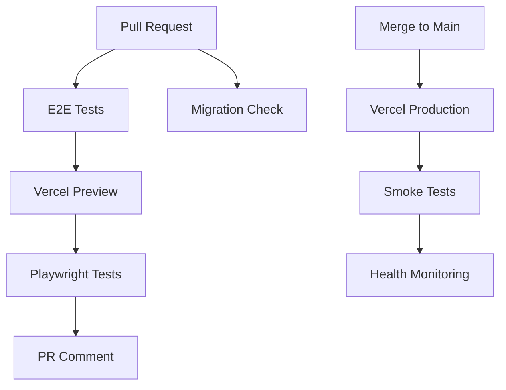

# Task: Document CI/CD Architecture

**Priority:** 🟡 Medium (Long-term)
**Effort:** 2-3 hours
**Type:** Documentation

## Problem

The CI/CD system has 12 workflows (~2,144 lines), but there's **no central documentation** explaining:
- What each workflow does
- When each workflow runs
- How workflows interact
- Troubleshooting common failures
- Architecture decisions

New contributors must read all YAML files to understand the system.

## Solution

Create comprehensive CI/CD documentation at `docs/dev/CI_CD.md`.

## Proposed Structure

```markdown
# CI/CD Architecture

## Overview

High-level diagram showing workflow relationships.

## Core Workflows

### PR Testing Pipeline
- `pr-e2e-tests.yml` - Multi-browser E2E tests on preview deployments
- `db-migrations.yml` - Validates schema changes
- `ci.yml` - Lint, build, unit tests (if added)

### Production Pipeline
- Vercel automatic deployments
- `production-smoke-test.yml` - Post-deploy verification (if added)
- `user-health-check.yml` - Weekly production monitoring

### AI Automation
- `claude.yml` OR `gemini-*.yml` (document whichever remains)

### Manual/Maintenance
- `bootstrap-migrations.yml` - One-time schema setup

## Workflow Details

### PR E2E Tests (`pr-e2e-tests.yml`)

**Triggers:** PR open, sync, reopen to main
**Duration:** ~15 minutes
**Cost:** ~900 runner minutes/month

**Jobs:**
1. `deploy-preview` - Deploys to Vercel with test database
2. `e2e-tests` - Runs Playwright tests (chromium, firefox, webkit)
3. `test-results` - Posts summary to PR
4. `cleanup` - Removes preview deployment
5. `status-check` - Final pass/fail gate

**Key Features:**
- Uses test database (slhyzoupwluxgasvapoc) to prevent email bounces
- Caches Playwright browsers
- Cancels stale runs (concurrency control)
- Posts results as PR comments

**Troubleshooting:**
- If preview deployment fails → check Vercel credentials
- If tests timeout → increase timeout in playwright.config.ts
- If tests flaky → check test-results artifacts

---

### Database Migrations (`db-migrations.yml`)

**Triggers:** Push to main, PRs
**Duration:** ~2 minutes
**Cost:** ~40 runner minutes/month

**Jobs:**
1. `migrate-check` - Validates migrations without applying

**Key Features:**
- Runs in `--check` mode on PRs (safe, no changes)
- Applies migrations on main branch push
- Uses NODE_OPTIONS for IPv4 connectivity
- Vercel pre-build hook (`vercel-build-step.mjs`) ensures prod schema is current

**Troubleshooting:**
- If connection fails → check SUPABASE_DB_* secrets
- If migration rejected → check `migrations/` for conflicts
- If Vercel build fails → check vercel-build-step.mjs logs

---

### [Continue for each workflow...]

## Secrets Management

| Secret | Used By | Purpose |
|--------|---------|---------|
| `VERCEL_TOKEN` | E2E, Deployment | Vercel API access |
| `VITE_SUPABASE_URL` | E2E, Build | Supabase project URL |
| `VITE_SUPABASE_ANON_KEY` | E2E, Build | Supabase anon key |
| `SUPABASE_DB_*` | Migrations | Database connection |
| ... | ... | ... |

**Location:** GitHub Repository → Settings → Secrets and variables → Actions

## Environment Strategy

| Environment | Database | Purpose |
|-------------|----------|---------|
| Production | gjftooyqkmijlvqbkwdr | Live users |
| Preview | slhyzoupwluxgasvapoc | PR E2E tests |
| Development | slhyzoupwluxgasvapoc | Local testing |

## Branch Protection Rules

Required status checks on main branch:
- [ ] E2E Status Check
- [ ] Database migrations check
- [ ] CI Checks (if added)

## Common Issues & Solutions

### Issue: E2E tests fail with "Network error"
**Cause:** Vercel preview not ready
**Solution:** Health check should catch this, but increase timeout if needed

### Issue: Migration fails with "connection refused"
**Cause:** Database pooler unreachable
**Solution:** Check SUPABASE_DB_HOST points to pooler (port 6543)

### Issue: Vercel build succeeds but deployment broken
**Cause:** Environment variable mismatch
**Solution:** Run `npm run vercel:check` to audit env vars

## Architecture Decisions

### Why preview deployments for E2E?
- Tests run against real Vercel environment
- Catches deployment-specific issues
- Uses test database to prevent bounce pollution

### Why separate test database?
- Prevents fake emails in production
- Avoids Supabase email bounce limits
- Allows safe data manipulation in tests

### Why Claude (and not Gemini)?
- As of 2025-11-11 the repository standardized on Claude; Gemini workflows were deleted to reduce cost and complexity.
- Document Claude as the sole on-demand AI assistant and remove/annotate any legacy Gemini references.

## Performance Benchmarks

| Workflow | Target | Current | Status |
|----------|--------|---------|--------|
| CI Checks | < 3 min | N/A | To be added |
| E2E Tests | < 20 min | ~15 min | ✅ |
| Migrations | < 5 min | ~2 min | ✅ |

## Monitoring & Alerts

- **GitHub Actions**: Email on workflow failure
- **Vercel**: Deployment notifications via Vercel dashboard
- **Supabase**: Email health checks (weekly, automated issue creation)

## Future Improvements

See `tasks/cicd-improvements/` for planned enhancements:
- Add basic CI checks (lint, build)
- Production smoke tests
- Performance monitoring

## Diagrams

[Add Mermaid diagrams showing workflow relationships]



## Related Documentation

- [Testing Guide](./TESTING.md)
- [Database Management](./DATABASE.md)
- [Deployment Process](./DEPLOYMENT.md)
- [CLAUDE.md](../../CLAUDE.md) - Quick commands reference
```

## Implementation Steps

1. Create `docs/dev/CI_CD.md` with above structure
2. Fill in details for each workflow
3. Add Mermaid diagrams
4. Take screenshots of key workflows
5. Link from main documentation index
6. Review with team

## Acceptance Criteria

- [ ] `docs/dev/CI_CD.md` created
- [ ] All active workflows documented
- [ ] Troubleshooting guide included
- [ ] Secrets and environments explained
- [ ] Architecture diagrams added
- [ ] Linked from `docs/INDEX.md`
- [ ] Team reviews and approves

## Benefits

- **Onboarding** - New contributors understand CI/CD quickly
- **Troubleshooting** - Common issues documented with solutions
- **Maintenance** - Architecture decisions preserved
- **Planning** - Clear view of what exists, what's missing

## Maintenance Plan

Update this document when:
- Adding/removing workflows
- Changing secrets or environments
- Modifying workflow triggers
- Discovering new troubleshooting steps

## Related

- See: `docs/dev/ARCHITECTURE.md` for application architecture
- See: `docs/dev/TESTING.md` for testing strategy
- See: `CICD_ANALYSIS.md` for initial assessment
