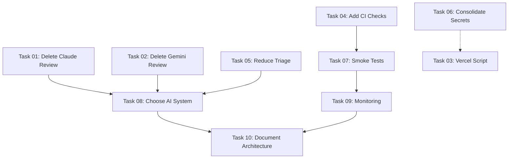

# CI/CD Improvement Tasks

This directory contains individual task files for improving the CI/CD setup based on the critical analysis in `/CICD_ANALYSIS.md`.

## Task Overview

| # | Task | Priority | Effort | Type | Status |
|---|------|----------|--------|------|--------|
| 01 | [Delete Disabled Claude Review](./01-delete-disabled-claude-review.md) | 🔴 High | 5 min | Cleanup | |
| 02 | [Delete Disabled Gemini Review](./02-delete-disabled-gemini-review.md) | 🔴 High | 5 min | Cleanup | ✅ Done |
| 03 | [Move Vercel Env Check to Script](./03-move-vercel-env-check-to-script.md) | 🟡 Medium | 15 min | Refactoring |✅ Done |
| 04 | [Add Basic CI Checks](./04-add-basic-ci-checks.md) | 🔴 High | 20 min | Feature |✅ Done |
| 05 | [Reduce Scheduled Triage Frequency](./05-reduce-scheduled-triage-frequency.md) | 🟠 High | 5 min | Optimization | ➖ Superseded (Gemini removed) |
| 06 | [Consolidate Database Secrets](./06-consolidate-database-secrets.md) | 🟡 Medium | 30 min | Refactoring | |
| 07 | [Add Production Smoke Tests](./07-add-production-smoke-tests.md) | 🟠 High | 45 min | Feature | |
| 08 | [Choose One AI System](./08-choose-one-ai-system.md) | 🔴 Critical | 2-3 hrs | Architecture | ✅ Done |
| 09 | [Add Production Monitoring](./09-add-monitoring.md) | 🟡 Medium | 3-4 hrs | Infrastructure | |
| 10 | [Document CI/CD Architecture](./10-document-cicd-architecture.md) | 🟡 Medium | 2-3 hrs | Documentation | |

## Recommended Implementation Order

### Phase 1: Quick Wins (Week 1)
**Goal:** Remove dead code, reduce costs immediately

1. **Task 01** - Delete disabled Claude review workflow (5 min)
2. **Task 02** - Delete disabled Gemini review workflow (5 min)
3. **Task 05** - Reduce scheduled triage frequency (5 min) *(superseded – Gemini workflows deleted in Task 08)*

**Impact:** Saves ~2,100 runner minutes/month, removes 339 lines of dead code

---

### Phase 2: Fill Critical Gaps (Week 2)
**Goal:** Add missing essential checks

4. **Task 04** - Add basic CI checks: lint + build + test (20 min)
5. **Task 07** - Add production smoke tests (45 min)

**Impact:** Catches build errors before deployment, verifies production deployments

---

### Phase 3: Simplify & Optimize (Week 3)
**Goal:** Reduce complexity, improve maintainability

6. **Task 03** - Move Vercel env check to script (15 min)
7. **Task 06** - Consolidate database secrets (30 min)

**Impact:** Easier debugging, 16 secrets → 2 secrets

---

### Phase 4: Strategic Decision (Week 4)
**Goal:** Eliminate AI system redundancy *(Completed 2025-11-11)*

8. **Task 08** - Choose Claude OR Gemini, remove the other (2-3 hrs) ✅ Completed – Claude retained, Gemini removed

**Impact:** Removes 4 Gemini workflows (~1,000 lines of YAML) and leaves Claude as the sole AI integration

---

### Phase 5: Production Hardening (Month 2)
**Goal:** Long-term reliability

9. **Task 09** - Add production monitoring (3-4 hrs)
   - Start with Layer 1 (deployment tracking)
   - Add Layer 2 (error tracking) if needed
   - Consider Layer 3 (performance) later

**Impact:** Proactive issue detection, faster debugging

---

### Phase 6: Documentation (Month 2-3)
**Goal:** Knowledge preservation

10. **Task 10** - Document CI/CD architecture (2-3 hrs)

**Impact:** Easier onboarding, better troubleshooting

---

## Expected Outcomes

### Before Optimization
- 12 workflows
- ~2,144 lines of YAML
- ~3,108 runner minutes/month
- 2 AI systems (redundant)
- Missing core checks (lint, build)
- No production verification

### After Optimization
- 6-7 workflows
- ~1,200 lines of YAML
- ~1,000 runner minutes/month
- 1 AI system (Claude) ✅
- Full CI coverage (lint, build, test)
- Production smoke tests
- Monitoring in place

### Improvements
- **60% reduction in complexity**
- **67% reduction in runner minutes**
- **50% reduction in workflows**
- **Zero loss in functionality**
- **Better coverage** (pre-deployment checks added)

## Priority Definitions

- 🔴 **High/Critical** - Do immediately (impacts production or creates technical debt)
- 🟠 **High** - Do within 1-2 weeks (important but not blocking)
- 🟡 **Medium** - Do within 1 month (nice to have, improves quality of life)

## Task Dependencies



**Legend:**
- Solid line: Hard dependency (must complete first)
- Dotted line: Soft dependency (helpful but not required)

> ℹ️ Task 05 remains in the dependency diagram for historical context but no longer requires work after removing the Gemini workflows.

## Usage

Each task file contains:
- **Problem statement** - What's wrong and why it matters
- **Solution** - Step-by-step implementation
- **Acceptance criteria** - Definition of done
- **Benefits** - Why this task is worth doing
- **Related tasks** - Connections to other improvements

## Progress Tracking

Create issues from these tasks:

```bash
# Option 1: Manual
# Create GitHub issues from each task file

# Option 2: Automated (using gh CLI)
for task in tasks/cicd-improvements/*.md; do
  gh issue create \
    --title "$(grep '^#' "$task" | head -1 | sed 's/# Task: //')" \
    --body-file "$task" \
    --label "ci-cd,enhancement"
done
```

## Questions?

- See main analysis: `/CICD_ANALYSIS.md`
- Check current workflows: `.github/workflows/`
- Review documentation: `docs/dev/TESTING.md`, `docs/dev/DEPLOYMENT.md`
